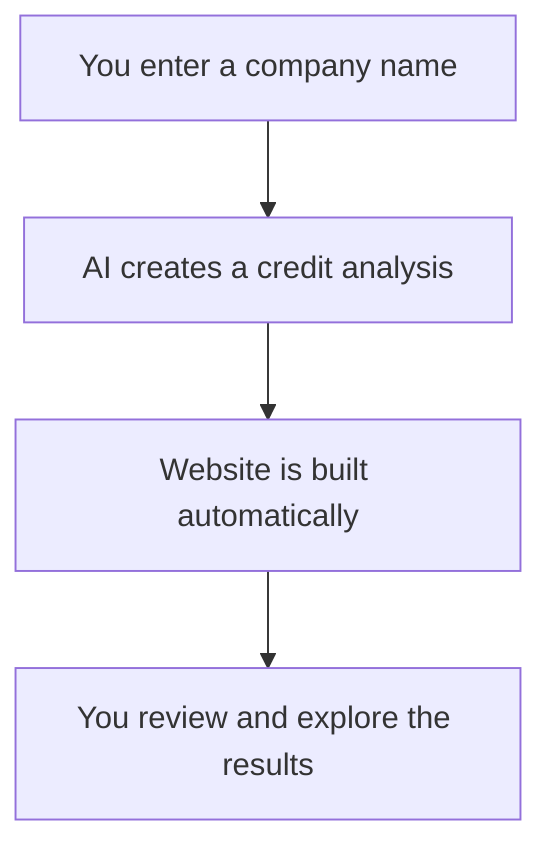

# Credit Analysis Agent Demo: Introduction & Context

---

## How to Use This File

Welcome! This file is your starting point for the demo.

You don’t need to know anything about coding—just follow the steps and you’ll see how we use AI to create a credit analysis and turn it into a modern website.

 

- **For the audience:** This is your guide to what’s happening and why.
- **For the coding agent:** This is the prompt to copy and paste to get started.

 

---

## Objective

Let’s kick things off by explaining what we’re about to do.

 

We’ll use AI to generate a credit analysis for any company, then turn that into a website you can actually use.

 

- No technical background required.
- Each step is simple and clear.
- If you get stuck, just ask questions or check the troubleshooting tips at the bottom.

 

---

## How the Agent-Powered Workflow Works

Here’s a simple diagram showing the flow:

 

### User Flow

1. **Input:** You enter a company name in the web app.
2. **Agent Reasoning:** The AI generates a structured credit analysis in markdown.
3. **UI Rendering:** The frontend renders the markdown as a modern, interactive website with collapsible sections and navigation.

 

### System Architecture

- **Frontend:**
  - Input box for company name
  - Sends async request to backend for analysis
  - Renders markdown using collapsible logic
- **Backend:**
  - API endpoint receives company name
  - Calls LLM (e.g., OpenAI, Azure, local model) to generate markdown
  - Returns markdown to frontend

 

---

## What We’ll Build

- A modular workflow where an agent:
  1. Accepts a company name or data.
  2. Generates a structured credit analysis from scratch.
  3. Dynamically builds a user-friendly website from the analysis.
  4. (Optionally) Adds advanced features like highlighting and interactivity (not included in this demo).

 

## Why This Matters

- See how AI can help with real-world financial analysis.
- Watch how we turn AI output into something interactive and useful.
- Learn a process that’s repeatable and easy to audit.

 

## Demo Workflow Overview

1. **Generate Credit Analysis** — The AI writes a credit analysis for you.
2. **Convert to Website** — The AI builds a website from the analysis.
3. **Review & Troubleshoot** — You get to explore and see what works (and what doesn’t).

 

## Prerequisites/Setup

- Coding agent IDE (e.g., Cascade, ChatGPT Code Interpreter, etc.)
- Basic knowledge of markdown, Python, and web technologies helpful but not required.
- Ensure you can run a local Python HTTP server: `python3 -m http.server` from the project root.
- Use a modern browser (Chrome, Edge, Firefox, Safari >=16).

 

## Troubleshooting & Demo Safety

- If a step fails, check for missing dependencies or incorrect file paths.
- Refer to the README for detailed troubleshooting and configuration notes.
- Ensure your environment supports required tools (Python 3.8+, modern browser, etc.).
- If you get stuck, calmly narrate the problem and check the README's troubleshooting section.
- Always keep the logic flow diagram handy (see README) for context.

 

## Demo Tips

- Narrate each step and what the audience should see.
- If something breaks, show how you diagnose and recover (audiences appreciate transparency!).
- If you need to skip a step, explain why and how you'd fix it later.

 

---

*For more details on each step, see the referenced prompt files and the README. For legacy requirements or design notes, see 99_legacy_overview.md.*
