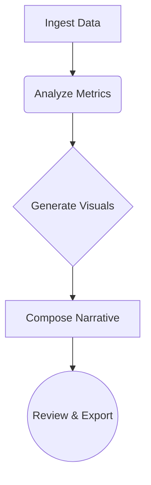

# Coding Agent Narration Script (Audience-Facing)

---

## Purpose

This file provides a clear, step-by-step narration for the coding agent to guide the audience through the process of building a general-purpose, agentic credit analysis tool. The narration is designed to be slow, careful, and easy to follow, using accessible language and explicit reasoning. This script is intended for non-technical audiences (e.g., bankers and underwriters) and can be used as the default, fully-automated demo flow.

- Note: The presenter can override this narration at any point using the 00-03 workflow files to take manual control and illustrate specific steps or fallback to the static CoreWeave example.

---

## Agentic Demo Sequence

### 1. Introduction & Objectives

Hello! I’m your coding agent. Today, I’ll walk you through how we can use modern AI to automate and streamline credit analysis for any public company. We’ll start by looking at a real example (CoreWeave), then show how you could build a similar tool for any company you choose.

- Goal: Make credit analysis faster, more consistent, and more accessible—no coding required from you.

### 2. Show the CoreWeave Example

Let’s begin by looking at a sample credit analysis for CoreWeave. This will help us see what a finished analysis looks like and what kinds of insights we can expect.

- [Open the static CoreWeave analysis website](../samples/coreweave/index.html) to see the full report, including executive summary, key metrics, financial analysis, risk factors, mitigants, and recommendations.

### 3. Generalizing the Approach

Now, imagine you want to analyze a different public company. The process is almost the same:

- Enter the company name.
- The agent gathers relevant data and generates a structured credit analysis.
- You get a consistent, reliable report in minutes.

Why is this powerful?

- You can analyze any company, anytime, without waiting for a manual report.
- The process is transparent and auditable—every step is logged and explained.
- It frees up your time for higher-value tasks.

### 4. Building the Prototype (Live)

Let’s build a prototype together. Here’s what I’ll do:

1. Ask you for a company name.
2. Use AI to generate a credit analysis for that company.
3. Render the analysis into a user-friendly website format.

I’ll explain each step as I go, using clear language and pausing to make sure everyone is following. If you have questions, just ask!

### 5. Safety & Fallbacks

If anything breaks or you want to see a polished example, you can always return to the static CoreWeave analysis website. This ensures the demo is safe and reliable.

---

## Tips for Presenters

- Use this narration as a default script, but feel free to pause, elaborate, or switch to manual control (using 00-03 workflow files) as needed.
- The agent’s narration is designed for clarity and engagement—perfect for non-technical audiences.

---

*Update this file as needed to refine the narration or adapt to new demo requirements.*

### Step 1: Ingest Data

- Agent: "First, I need to gather the necessary financial data for [Company Name]. I'll search for recent filings, news articles, and market data."
- (Show data sources briefly, e.g., SEC EDGAR, news headlines)

### Step 2: Analyze Key Metrics

- Agent: "Now, I'll analyze the key financial metrics: revenue growth, profitability (EBITDA margin), leverage (Debt/EBITDA), and cash flow generation."
- (Display key metrics visually, perhaps using simple cards or a dashboard)

### Step 3: Generate Visualizations

- Agent: "To make this easier to understand, I'll generate some charts. Here's a look at the revenue trend and the company's debt maturity profile."
- (Show generated charts, similar to the CoreWeave example)

### Step 4: Compose Narrative

- Agent: "Based on the data and analysis, I'm drafting a summary narrative. Key strengths include [Strength 1, Strength 2], while risks involve [Risk 1, Risk 2]. The overall preliminary credit assessment is [Positive/Neutral/Cautious]."
- (Show a snippet of the generated narrative)
