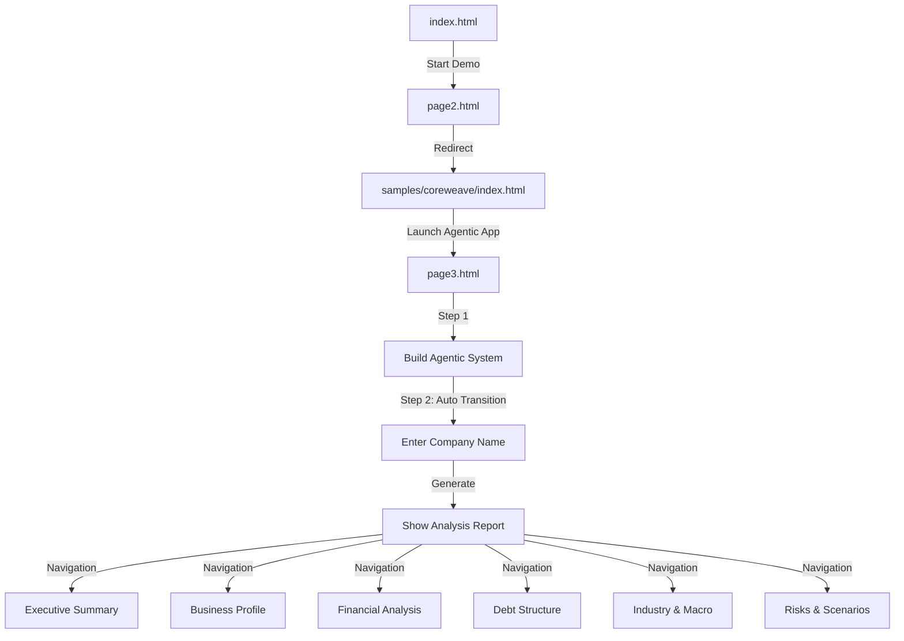

# Agentic Credit Assessment Application

## Project Overview

This project demonstrates an **agentic AI approach to credit analysis** that can build complete credit memos for any company. It uses CoreWeave as just one showcase example, but the system is designed to generate credit assessments for any company. The application features:

- A professional, branded landing page

- A working credit analysis example for CoreWeave to showcase capabilities

- An agentic app that can generate comprehensive credit reports for any company

- Interactive charts, collapsible sections, and responsive design

- Robust error handling and detailed console logs

---

## Current Project State (May 2025)

- **Demo Flow:** All pages connect properly (index.html → page2.html → samples/coreweave/index.html → page3.html)

- **UI Components:** Clean, branded styling with professional appearance

- **Agentic Simulation:** Enhanced with realistic timing and detailed steps

- **Navigation:** Collapsible sections and sidebar navigation fixed and working correctly

- **Report Sections:** All sections now have complete content with tables and visualizations

- **Debug Panel:** Debug mode enabled with visual debugging panel for development

- **Backups:** Original files preserved in `/backups` directory

---

## Recent Improvements (May 2025)

- **Fixed Navigation:** Resolved issue with page3.html navigation between steps and sidebar links

- **Complete Content:** Added detailed content to all previously empty sections in the report

- **Enhanced Visualizations:** Added customer concentration pie chart and debt maturity chart

- **Improved UI:** Fixed layout structure with proper flexbox styling and responsive design

- **Better Transitions:** Added smooth transitions between steps with visual cues

- **Debug System:** Added comprehensive debug logging and debug info panel for development

- **Documentation:** Completely revised README.md to accurately reflect the project

---

## Current Limitations / Future Enhancements

- **Company Templates:** Currently using a single template for all companies, need company-specific data

- **Chart Interactivity:** Charts are static; could be enhanced with more interactivity

- **Mobile Optimization:** Basic responsiveness implemented, but could be further optimized

- **Error Handling:** Has basic error handling but could benefit from more robust error states

---

## File Structure & Purpose

| File/Directory | Purpose |
|----------------|---------|
| `index.html` | Landing page with title and "Start Demo" button |
| `page2.html` | Redirects to CoreWeave example in samples/coreweave/index.html |
| `page3.html` | Agentic app interface for company credit analysis |
| `agentic.js` | Core logic for the agentic simulation and report generation |
| `samples/coreweave/index.html` | CoreWeave credit analysis example (one of many potential companies) |
| `samples/coreweave/analysis.md` | Markdown content for CoreWeave analysis |
| `backups/` | Original file backups before enhancements |
| `archive/` | Legacy files no longer actively used |

---

## Agentic.js Architecture

The agentic.js file is organized into six main sections:

1. **Utility Functions:** Core helpers like logStatus(), getRandomTiming(), and updateDebugStatus()

2. **Agentic Build Process:** Simulates building the AI analysis system with sequential steps

3. **Report Generation:** Handles company input and generated analysis with realistic timing

4. **Report Templates:** HTML templates for rendering reports with complete sections

5. **UI Interaction:** Managing collapsible sections, navigation, and transitions

6. **Event Listeners & Initialization:** DOM initialization and application setup

Key design patterns used:
- **Modular Function Organization:** Clear separation of concerns with well-named functions
- **Sequential Simulation:** Using setTimeout chains for realistic agentic processes
- **Event Delegation:** Proper event handling for dynamic content
- **Defensive Programming:** Extensive error handling and logging
- **Progressive Enhancement:** Works without JavaScript but enhanced with it

This architecture makes it easy to:
- Add new report templates for specific companies
- Enhance the simulation with additional steps
- Implement more detailed analysis sections
- Add new chart types and visualizations

---

## Page3.html Architecture

The page3.html file is structured as a two-column application:

1. **App Sidebar (`#app-sidebar`):** Contains the main workflow steps (Build Solution → Generate Report)

2. **App Content (`#app-content`):** Contains the application workflow steps and report display

3. **Debug Panel:** Provides useful information during development

Key UI components:
- **Step Sections:** Collapsible sections for different workflow steps
- **Report Display:** Dynamic report generation area with its own navigation
- **Log Area:** Real-time feedback during the agentic process

The page uses distinct ID naming to prevent conflicts between:
- The application workflow navigation (`#app-sidebar`, `#app-content`)
- The generated report navigation (`#sidebar`, `#content`)

---

## User Flow

1. **Start Experience:** User lands on index.html with brand styling

2. **View Example:** User clicks "Start Demo" to see a CoreWeave credit analysis as an example

3. **Try Agentic App:** User clicks "Launch Agentic App" to open page3.html

4. **Build System:** User clicks "Start Agentic Build" to initialize the AI system

5. **Generate Report:** User enters any company name and receives detailed credit analysis

6. **Explore Sections:** User navigates between report sections via sidebar links

---

## Running the Demo

To run the application locally:

```bash
cd "/Users/arilehavi/Desktop/Agentic Credit Analysis"
python3 -m http.server 8000
```

Then open a browser and go to `http://localhost:8000`

---

## Enhancement Roadmap

1. **Content Expansion:**
   - Create specific templates for different companies (Apple, Microsoft, etc.)
   - Add real-time financial data fetching for dynamic reports

2. **Visualization Improvements:**
   - Add more interactive charts with tooltips and drill-down capabilities
   - Implement comparison features between different companies
   - Add historical trend analysis charts

3. **UX Refinements:**
   - Add loading indicators during generation
   - Improve mobile responsiveness
   - Add print/export functionality
   - Implement dark mode support

4. **Technical Enhancements:**
   - Add unit tests for core functions
   - Optimize template rendering for performance
   - Improve error handling with user-friendly recovery options
   - Add local storage to save generated reports

---

## Logic Flow Diagram



---

## Debugging

The application includes a comprehensive debugging system:

1. **Debug Mode:** Set `DEBUG_MODE = true` in agentic.js to enable debug features

2. **Debug Panel:** Visual overlay showing section counts, link counts, and status

3. **Console Logging:** All key actions are logged with the `[AgenticApp]` prefix

4. **Error Handling:** Try/catch blocks with detailed error information

To use the debugging features:

- Open browser developer tools (F12 or right-click → Inspect)

- Filter console logs by "[AgenticApp]" to see application activity

- Watch the debug panel in the bottom-right corner for real-time info

---

## Development Notes

- All JavaScript is vanilla JS with no external dependencies except Chart.js

- Chart.js is loaded dynamically when needed in the report template

- Console logs use the format [AgenticApp] for easy filtering

- Error handling includes both UI feedback and console logging

- Simulation timing uses randomization for realistic feel

- CSS uses flexbox for layout with responsive considerations

---

## For Developers

- Before adding new files, check existing ones to avoid duplication

- Keep this README up to date after every major change

- Use comprehensive JSDoc comments for all new functions

- Maintain the section-based organization in agentic.js

- Always include detailed error logging

- Test all changes in both desktop and mobile views
